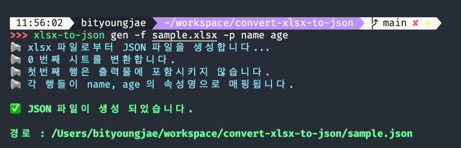

# convert-xlsx-to-json



`convert-xslx-to-json`은 `xlsx` 파일을 특정한 형태의 `JSON` 파일로 변환하기 위한 `CLI 도구` 등을 제공합니다.

## 목차
- [convert-xlsx-to-json](#convert-xlsx-to-json)
  - [목차](#목차)
  - [설치](#설치)
    - [NPM](#npm)
    - [yarn](#yarn)
  - [CLI 도구로 사용시](#cli-도구로-사용시)
    - [npx로 실행](#npx로-실행)
    - [전역 설치 후 실행](#전역-설치-후-실행)
    - [gen 메서드](#gen-메서드)
    - [매개변수 종류](#매개변수-종류)
    - [기본 사용법](#기본-사용법)
    - [파일 경로에 관한 TIP](#파일-경로에-관한-tip)
    - [특정 열 제외하기](#특정-열-제외하기)
    - [앞부분 일부만 포함시키기](#앞부분-일부만-포함시키기)
    - [첫번째 열을 헤더로 사용하는 경우](#첫번째-열을-헤더로-사용하는-경우)
    - [헤더가 없는 경우](#헤더가-없는-경우)
    - [특정 범위를 지정하고 싶을 때](#특정-범위를-지정하고-싶을-때)
    - [특정 시트를 지정하고 싶을 때](#특정-시트를-지정하고-싶을-때)
  - [xlsx 변환 api로 사용시](#xlsx-변환-api로-사용시)
    - [매개변수 정보](#매개변수-정보)

## 설치

### NPM

```shell
# CLI만 사용시 전역 설치를 권장합니다.
npm i -g convert-xlsx-to-json

# 내부 api를 사용하고자 하면 로컬로 설치해주세요.
npm i convert-xlsx-to-json
```

### yarn

```shell
# CLI만 사용시 전역 설치를 권장합니다.
yarn global add convert-xlsx-to-json

# 내부 api를 사용하고자 하면 로컬로 설치해주세요.
yarn add convert-xlsx-to-json
```

## CLI 도구로 사용시

### npx로 실행

CLI 도구만 사용하길 희망하신다면 `npx convert-xlsx-to-json ...params`로 설치 없이 사용하실 수 있습니다.

### 전역 설치 후 실행

혹시 npm 혹은 yarn을 이용해 해당 패키지를 전역 설치 하셨다면,
아래의 명령어들을 콘솔상에서 직접 사용하실 수도 있습니다.

```shell
convert-xlsx-to-json gen -f ./target.json -p age name

# 같은 동작을 합니다.
xlsx-to-json gen -f ./target.json -p age name
```

### gen 메서드

현재 오직 `gen` 메서드 하나만을 지원합니다.<br/>
이 메서드는 xlsx 파일로부터 json 파일을 생성해 저장하는 동작을 담당합니다.

### 매개변수 종류

gen 메서드에는 아래의 매개변수들이 추가로 전달될 수 있습니다.

| Parameter | Alias | required? | default | Description | Example |
|:-:|:-:|:-:|:-:|:-:|:-:|
| --from | -f | ✅ |  | 변환할 xlsx 파일의 경로 | -f ./target.xlsx |
| --to | -t |  | 현재 경로/[xslx파일명].json | 저장될 JSON 파일의 경로 | -t ./json/out.json |
| --propKeys | -p | ✅ |  | propKey로 사용될 리스트. _로 표시된 순번은 결과물에 포함하지 않는다. | -p name age _ ext |
| --sheetIndex | -i |  | 0 | 변환할 시트 인덱스 (0부터 시작) | -i 1 |
| --omitHeader | -o |  | true | 첫번째 행 혹은 열을 생략할지 여부 | -o |
| --columnEntity | -c |  | false | 데이터를 열 단위로 해석할지의 여부 | -c |
| --range | -r |  |  | A1 스타일로 표현된 해석할 셀의 범위. omitHeader 옵션은 무시된다. | -r A1 or -r A1:C8 |

### 기본 사용법

_아래와 같은 내용의 xlsx 파일이 있다고 가정하겠습니다._

| 이름 | 나이 | 국적 | 기타 설명 |
|:-:|:-:|:-:|:-:|
| BitYoungjae | 30 | South Korea | 잡다한 것 만들기를 좋아한다. |
| Kakarot | 39 | Vegeta | Munchkin |

다음의 명령어를 통해 위 내용의 xlsx 데이터를 JSON 파일로 저장할 수 있습니다.

```shell
npx convert-xlsx-to-json gen --from ./data.xlsx --to ./data.json --propKeys name age country etc
```

`from` 매개변수로 전달된 `./data.xlsx`는 변환의 대상이 되는 xlsx 파일의 경로이며,<br/>
`to` 매개변수로 전달된 `./data.json`은 출력물인 JSON 파일이 저장될 경로입니다.

`xlsx` 상에서 각각의 행으로 표현된 `entity`들은 `propKeys` 매개변수로 전달된 `키`들을 `속성명`으로 삼아 `JSON Object`로 변환이 됩니다.

변환된 `data.json`의 내용물은 아래와 같습니다.

```json
[
  {
    "name": "BitYoungjae",
    "age": 30,
    "country": "South Korea",
    "etc": "잡다한 것 만들기를 좋아한다."
  },
  {
    "name": "Kakarot",
    "age": 39,
    "country": "Vegeta",
    "etc": "Munchkin"
  }
]
```

### 파일 경로에 관한 TIP

> **파일 경로는 상대경로와 절대경로 두가지 방법으로 지정하실 수 있습니다.**<br/>
> 상대경로로 지정할 경우 convert-xlsx-to-json 명령어를 호출한 경로를 기준삼아 파일 경로를 계산합니다.
> 
> **to 매개변수의 경우 생략이 될 수 있습니다.**<br/>
> 생략될 경우 xlsx 파일의 파일명에 따라 json 파일명이 자동으로 지정됩니다.<br/>
> _존재하지 않는 경로일 경우 강제로 생성합니다._
 
아래의 명령어 예시의 경우 `data.xlsx` 파일로부터 `data.json` 파일을 생성합니다.

```shell
npx convert-xlsx-to-json gen --from ./data.xlsx --propKeys name age country etc
```

### 특정 열 제외하기

_역시 같은 데이터가 xlsx 파일로 준비되어 있다고 가정하겠습니다._

| 이름 | 나이 | 국적 | 기타 설명 |
|:-:|:-:|:-:|:-:|
| BitYoungjae | 30 | South Korea | 잡다한 것 만들기를 좋아한다. |
| Kakarot | 39 | Vegeta | Munchkin |

이 중에서 우리는 `이름`과 `국적`에 해당하는 데이터만 JSON으로 추출하고 싶습니다.<br/>
그럴 때는 propKeys 매개변수에 _를 사용하여 해당하는 위치의 데이터를 결과물에서 제외할 수 있습니다.

```shell
npx convert-xlsx-to-json gen --from ./data.xlsx --to ./data.json --propKeys name _ country _
```

`나이`와 `기타 설명`에 해당하는 두번째와 네번째 위치에 `_`를 사용했음을 확인하실 수 있습니다.

출력된 `./data.json`의 내용물은 아래와 같습니다.

```json
[
  {
    "name": "BitYoungjae",
    "country": "South Korea"
  },
  {
    "name": "Kakarot",
    "country": "Vegeta"
  }
]

```

### 앞부분 일부만 포함시키기

_이번에도 같은 데이터가 xlsx 파일로 준비되어 있다고 가정하겠습니다._

| 이름 | 나이 | 국적 | 기타 설명 |
|:-:|:-:|:-:|:-:|
| BitYoungjae | 30 | South Korea | 잡다한 것 만들기를 좋아한다. |
| Kakarot | 39 | Vegeta | Munchkin |

만약 `propKeys`로 주어진 속성명의 갯수가 xlsx 상의 특정 `entity`의 실제 컬럼 갯수보다 작을 경우,<br/>
주어진 속성명 갯수 이후의 데이터는 결과물에서 자동으로 무시됩니다.

```shell
npx convert-xlsx-to-json gen --from ./data.xlsx --to ./data.json --propKeys name age
```

`propKeys` 매개변수로 주어진 속성명들이 `name`과 `age` 뿐이므로 `국적`과 `기타 설명`에 해당하는 xlsx 상의 데이터는 무시됩니다.

출력된 `./data.json`의 내용물은 아래와 같습니다.

```json
[
  {
    "name": "BitYoungjae",
    "age": 30
  },
  {
    "name": "Kakarot",
    "age": 39
  }
]
```

### 첫번째 열을 헤더로 사용하는 경우

이번에는 xlsx 데이터의 구성이 조금 다른 형태라고 가정해보겠습니다.

| 이름 | BitYoungjae | Kakarot |
|-:|:-|:-|
| **나이** | **30** | **39** |
| **국적** | **South Korea** | **Vegeta** |
| **기타 설명** | **잡다한 것 만들기를 좋아한다.** | **Munchkin** |

첫번째 열이 테이블 헤더의 역할을 하고, 이후의 열들이 각각의 entity를 구성하는 형태입니다.<br/>
이런 형태의 데이터는 `--columnEntity` 매개변수를 추가하여 의도한대로 변환이 가능합니다.

```shell
npx convert-xlsx-to-json gen --from ./data.xlsx --to ./data.json --propKeys name age country etc --columnEntity 
```

저장된 `data.json`의 내용물은 아래와 같습니다.

```json
[
  {
    "name": "BitYoungjae",
    "age": 30,
    "country": "South Korea",
    "etc": "잡다한 것 만들기를 좋아한다."
  },
  {
    "name": "Kakarot",
    "age": 39,
    "country": "Vegeta",
    "etc": "Munchkin"
  }
]
```

### 헤더가 없는 경우

아래와 같이 Entity를 열 단위로 구성하였으며, 별도의 **헤더**가 없는 데이터라고 가정해보겠습니다.

|BitYoungjae | Kakarot |
|:-:|:-:|
| **30** | **39** |
| **South Korea** | **Vegeta** |
| **잡다한 것 만들기를 좋아한다.** | **Munchkin** |

이런 형태의 데이터는 `--omitHeader` 매개변수를 `false` 로 지정하여 의도한대로 변환이 가능합니다.

```shell
npx convert-xlsx-to-json gen --from ./data.xlsx --to ./data.json --propKeys name age country etc --omitHeader false
```

저장된 `data.json`의 내용물은 아래와 같습니다.

```json
[
  {
    "name": "BitYoungjae",
    "age": 30
  },
  {
    "name": "Kakarot",
    "age": 39
  }
]
```

### 특정 범위를 지정하고 싶을 때

기본적으로 convert-xlsx-to-json은 A1 셀부터 시작되는 데이터 테이블이 있음을 전제로 동작합니다.<br/>
하지만 혹시 특정 범위의 셀 영역을 변환하고 싶으시다면 `--range` 매개변수를 이용해 지정하실수도 있습니다.

```shell
npx convert-xlsx-to-json gen --from ./data.xlsx --to ./data.json --propKeys name age --range C5:Z9
```

### 특정 시트를 지정하고 싶을 때

`convert-xlsx-to-json`은 별도의 설정이 없으면 첫번째 시트의 데이터만을 변환합니다.<br/>
만약 특정 시트를 지정하여 변환하고자 한다면 `--sheetIndex` 매개변수를 이용해 특정 시트를 지정하실 수 있습니다.

시트의 이름이 아닌 몇번째 시트인지를 가리키는 index값을 매개변수의 값으로 전달해주셔야 합니다.<br/>
시트의 index는 `0-based numbering`을 따릅니다.

**즉, 첫번째 시트는 숫자 0으로 지정할 수 있으며 두번째는 1 세번째는 2로 지정해주셔야만 합니다.**

아래는 세번째 시트의 데이터만을 변환하는 내용의 명령어 예시 입니다.

```shell
npx convert-xlsx-to-json gen --from ./data.xlsx --propKeys name age --sheetIndex 2
```

## xlsx 변환 api로 사용시

혹시 xlsx 파일을 JSON 파일로 저장하는 것에는 관심이 없고,<br/>
위와 같은 규칙으로 단순 xlsx 파일을 자바스크립트 데이터로 변환만하고 싶으시다면

아래처럼 활용도 가능합니다.

단, 이 경우 `convert-xlsx-to-json` 패키지가 로컬로 설치가 되어 있어야만 합니다.

```js
import path from 'path';
import { xlsxToJSON } from 'convert-xlsx-to-json';

const xlsxPath = "~/documents/data.xlsx";
const entities = xlsxToJSON(xlsxPath, ["name", "age", "_", "etc"], 0, true, false);
```

### 매개변수 정보

| name | type | required? | default |
|:-:|:-:|:-:|:-:|
| xlsxPath | string | ✅ | - |
| propKeys | string[] | ✅ | - |
| sheetIndex | integer | | 0 |
| omitHeader | boolean | | true |
| columnEntity | boolean | | false |
| range | string | | - |

자세한 정보는 [매개변수 종류](#매개변수-종류)를 참고해주세요.